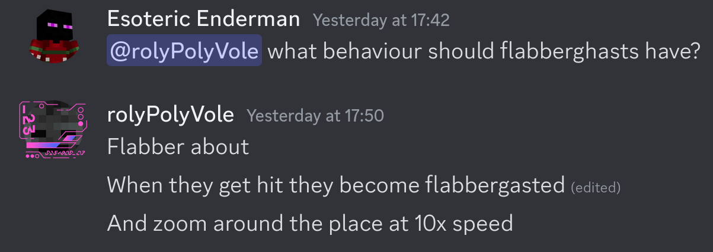

# Ideas

This file is used to track ideas for future development of this project.

## Snow Golems

- [X] Increase detection range.
- [ ] Make snow golems be able to gain more max health.
- [ ] Make snow golems increase/decrease in size depending on how much health they have.
- [X] Don't heal snow golems when they are hit with a snowball in the face (pumpkin), as that wouldn't add more snow to their body.
- [X] Regenerate (or get stronger?) when they're in a cold biome.
- [X] Regenerate during snowy weather.

## Ghasts

### Nuclear Ghasts

- [X] Add more radiation effects (blindness).

### Black Hole Ghasts

- [ ] Have projectiles circle around black hole ghasts.
- [ ] Have black hole ghasts be able to shoot their orbiting projectiles at the player.
- [ ] Have black hole ghasts pull in the player and damage them when they are in the center.
- [X] Make black hole ghasts smaller, as they are more dense than normal ghasts.

### Flabberghasts

- [ ] Flabber about.
- [ ] Zoom around when they get hit.

### Ur-Ghasts

- [X] Just a bigger variant of normal ghasts, that's it...
